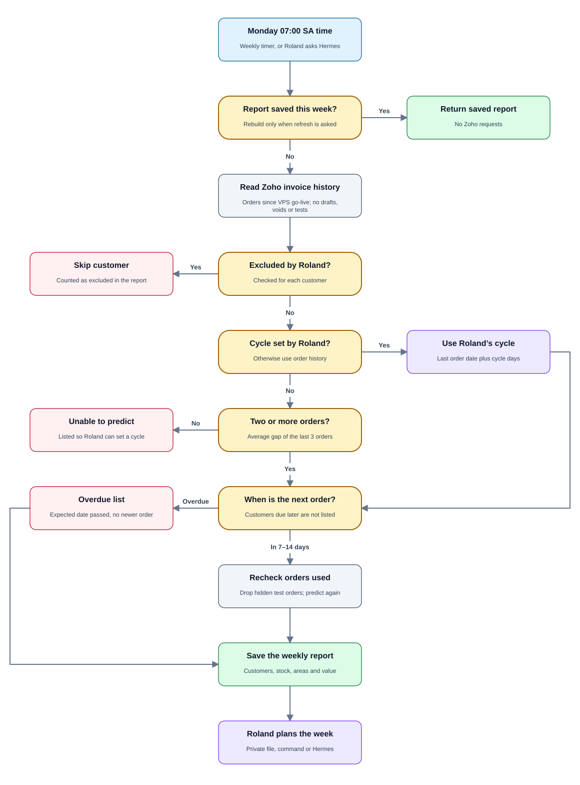

# HustleAI

Zoho Invoice workflows and owner-side Hermes MCP tools, with a separate home for
future WhatsApp customer automation and active hosted Supabase storage.

## Start here

- [Repository architecture](docs/architecture/REPOSITORY.md) — code layout and dependency boundaries.
- [Visual flow guide](docs/flow-guide.html) — nine rendered diagrams; opens offline in a browser.
- [Code walkthrough](docs/architecture/CODE_WALKTHROUGH.md) — introduction for first-time readers.
- [All documentation](docs/README.md) — PRDs, setup and workflow guides.

## Layout

```text
src/hustleai/       Application package
  integrations/    Zoho transport; planned WhatsApp gateway boundary
  workflows/       Clients, invoices, payments, reorders and approvals
  mcp/             Owner-side Hermes tools
  storage/         PostgreSQL repositories, private files and legacy test adapters
  domain/          Phone and input validation
  cli/             Setup, upgrade and contact commands
supabase/          PostgreSQL schema, migration and recovery guide
tests/             Isolated unit and MCP integration tests
scripts/           Documentation generation
docs/              One documentation tree: architecture, guides, PRDs, diagrams
deploy/            VPS setup and Hermes configuration example
```

Root `zoho_*.py` scripts remain compatibility entry points. Make new changes in
`src/hustleai/`, not the wrappers.

## Install and run

Python 3.11 or newer:

```sh
python3 -m venv .venv
.venv/bin/pip install -e '.[postgres]'
.venv/bin/hustleai-contacts lookup
.venv/bin/python -m hustleai.mcp.owner_server
```

Existing commands remain valid:

```sh
python3 zoho_upgrade.py
python3 zoho_clients.py lookup
python3 zoho_clients.py sync
```

The owner MCP exposes 18 tools, including a weekly
[reorder forecast](docs/guides/REORDER_FORECAST.md) for stock and delivery planning. Customer gateway authorization and WhatsApp
sending are not implemented yet. See [workflow tools](docs/guides/ZOHO_WORKFLOW_TOOLS.md).

## WhatsApp gateway

The gateway receives messages to the business WhatsApp number (Meta Cloud API).
Only Roland's number, verified from Meta's signed webhook, can run `CONFIRM`,
`APPROVE` and `FORECAST`. Customer messages are referred to Roland. The
business number is a setting: run `hustleai-whatsapp setup` when it arrives.
See the [gateway guide](docs/guides/WHATSAPP_GATEWAY.md) and every run time in
[SCHEDULED_TASKS.md](SCHEDULED_TASKS.md).

## Tax

The business is not VAT-registered. `.zoho-local.json` sets
`"vat_registered": false`, so invoices carry no tax, prices are final and no VAT
is shown. If the business registers for VAT, remove that setting, create the
VAT tax in Zoho and assign it to products.

## Weekly reorder forecast

Every Monday at 07:00 South African time, the forecast lists customers expected
to order **7 to 14 days** later. It reads Zoho only and never contacts
customers. See the [flow and PRD](docs/prds/09-reorder-forecast.md) and the
[operating guide](docs/guides/REORDER_FORECAST.md).



**How the next order is predicted**

1. Only real orders count: sent, overdue, paid, partially paid or unpaid
   invoices. Drafts, voids, test invoices and future-dated invoices are ignored.
2. Several invoices on one day count as one order.
3. The cycle is the average gap between the customer's **last three orders**.
   The next order is expected on the last order date plus that cycle.
4. A cycle you set for a customer replaces the history average.
5. Confidence is low with only two orders, or when the gaps are uneven.
6. A customer with one order is listed under "Unable to predict" until you set a cycle.
7. Only orders from the **tracking start date** onward count. Set it on the day
   the app goes live on the VPS, so older, patchy invoice history is ignored:

   ```sh
   .venv/bin/hustleai-forecast start-date today
   ```

**Choosing which customers appear**

Every customer with order history is included automatically. Adjust the list
with these commands, or ask Hermes to do the same:

```sh
.venv/bin/hustleai-forecast cycles set 0821234567 21    # order every 21 days
.venv/bin/hustleai-forecast cycles exclude 0821234567   # stopped ordering
.venv/bin/hustleai-forecast cycles include 0821234567   # bring back
.venv/bin/hustleai-forecast cycles clear 0821234567     # use order history again
.venv/bin/hustleai-forecast cycles list                 # show your settings
```

Add `--contact-id` when several clients share one number. Excluding a customer
keeps any cycle you set, and setting a cycle includes them again.

**Running it**

```sh
.venv/bin/hustleai-forecast run --print             # build today's report, or reuse today's
.venv/bin/hustleai-forecast run --refresh --print   # rebuild from Zoho now
```

The report lists expected customers, stock totals per product, deliveries by
area, overdue customers, customers without enough history, and an estimated
value from past invoices. It is saved in Supabase and in the private `reports/`
folder, which is excluded from Git. Schedule files for the Mac and the VPS are
in `deploy/schedule/`; install only one.

**Orders copy.** The forecast reads a Supabase copy of Zoho invoices, so it runs
in seconds. Invoices the app creates or changes are copied immediately. Every
night at 22:00, before Zoho's daily limit of 1,000 requests resets at midnight
South African time, `hustleai-orders sync` compares all invoices, copies changes,
flags deletions and reads missing details with the requests left over.

## Data and Supabase status

Hosted Supabase PostgreSQL now stores the phone index and workflow state. The
verified migration preserved 67 phone mappings, 5 operations, 2 reviews and
2 approvals. Old approvals remain invalid. See the [storage and recovery guide](supabase/README.md).
The migrated local SQLite and Markdown copies have been removed. Database
outages stop workflows rather than silently switching to local state.

Private credentials, certificates and PDFs remain at their existing paths. Set `HUSTLEAI_DATA_DIR` to an absolute private directory for VPS
deployment; it does not move data automatically. See [deployment](deploy/README.md).
The price-list PDF will remain local with a separate backup. Never commit private
runtime files or credentials.

## Tests

```sh
.venv/bin/python -m unittest discover -s tests -v
```

Tests use synthetic data and temporary storage. MCP startup/discovery does not
call Zoho or create records. Legacy root test commands remain supported.

## Diagrams

```sh
python3 scripts/generate_flow_diagrams.py
```

This rebuilds `docs/flow-guide.html` and `docs/diagrams/*.svg` without external
rendering services.
