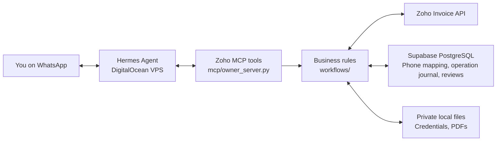
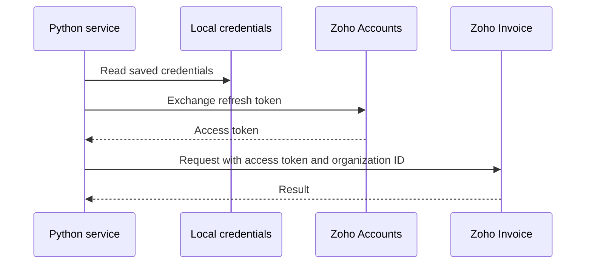
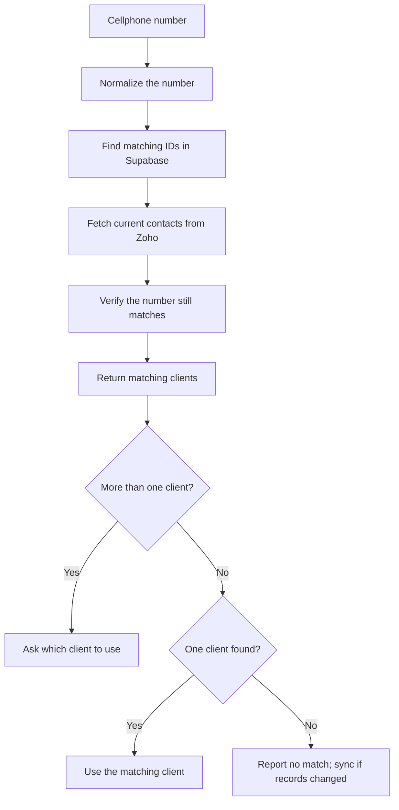
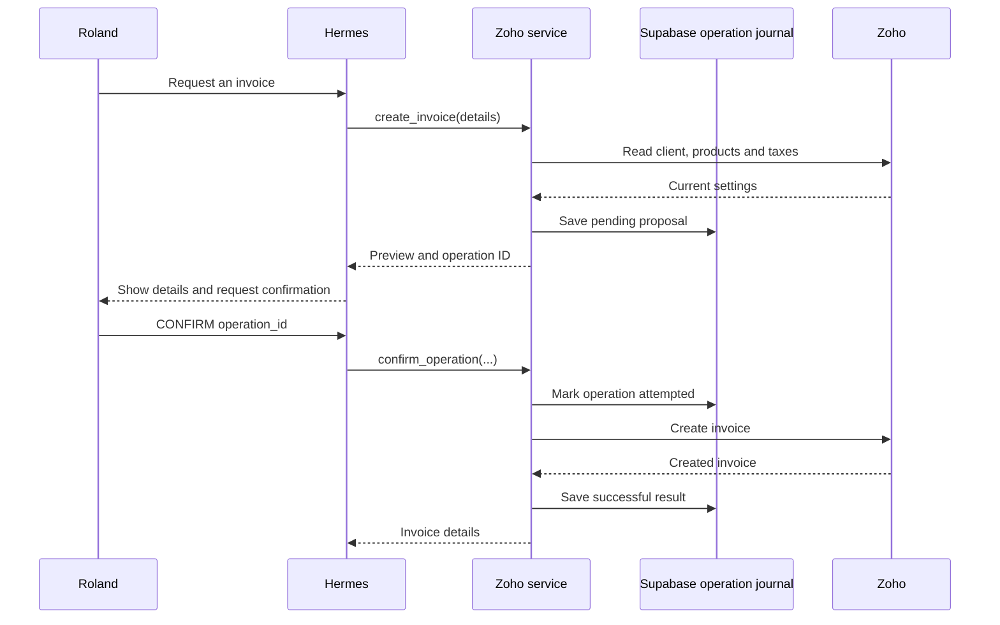
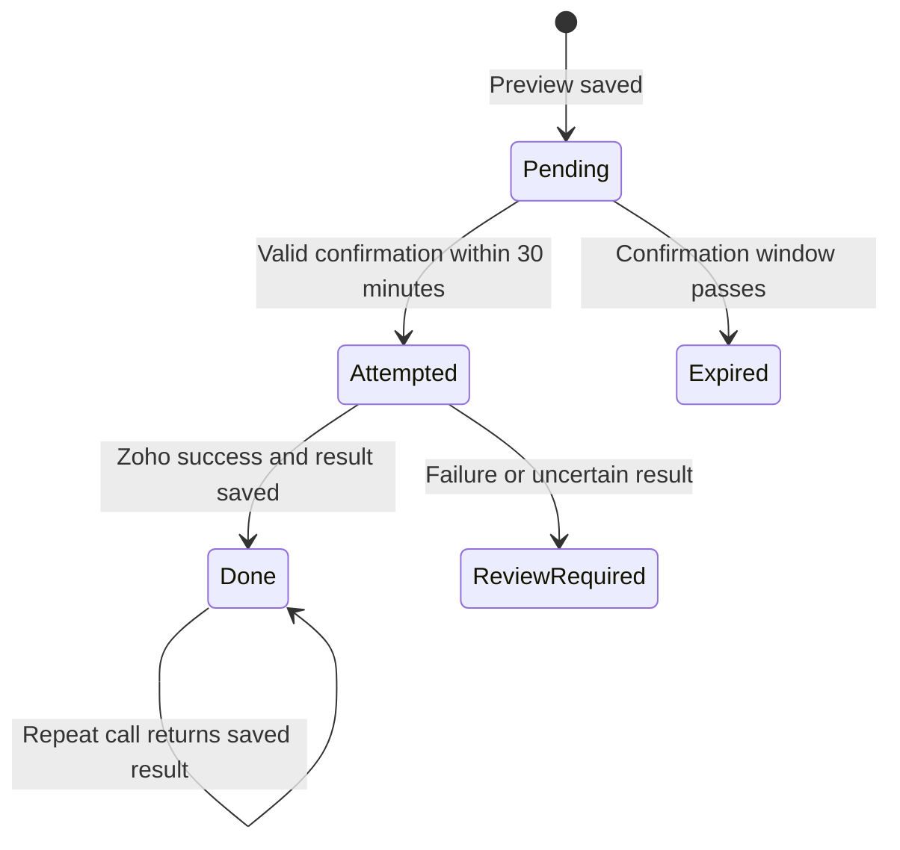

# How the Zoho Invoice integration works

This guide introduces the code for someone reading it for the first time.
The application now lives under `src/hustleai/`; root `zoho_*.py` files are
compatibility entry points. See [repository layout](REPOSITORY.md).
Hermes interprets your WhatsApp requests, calls the appropriate Zoho tools,
and presents the results to you.

The Zoho tools have been built and tested locally. DigitalOcean deployment
and the Hermes WhatsApp connection still need to be set up. See
[the deployment guide](../guides/HERMES_SETUP.md) for installation instructions.



## 1. Start with the files

Read these files in request-flow order rather than trying to understand
everything at once:

| File | Purpose |
| --- | --- |
| [src/hustleai/mcp/owner_server.py](../../src/hustleai/mcp/owner_server.py) | Named tools Hermes can discover and call. Start here. |
| [src/hustleai/workflows/invoice_review.py](../../src/hustleai/workflows/invoice_review.py) | Reorder history, guarded draft updates, versioned reviews and approvals. |
| [src/hustleai/workflows/service.py](../../src/hustleai/workflows/service.py) | Client, invoice, payment, validation, and confirmation logic. |
| [src/hustleai/integrations/zoho/client.py](../../src/hustleai/integrations/zoho/client.py) | OAuth, HTTP requests, pagination and PDF downloads. |
| [src/hustleai/cli/setup.py](../../src/hustleai/cli/setup.py) | Initial OAuth setup and verified HTTPS configuration. |
| [src/hustleai/cli/upgrade.py](../../src/hustleai/cli/upgrade.py) | Replaces the refresh token after expanded permissions are authorized. |
| [tests/unit/test_zoho_tools.py](../../tests/unit/test_zoho_tools.py) | Automated tests using simulated Zoho responses. |
| [HERMES_SETUP.md](../guides/HERMES_SETUP.md) | Installation and operating instructions. |

A **class** groups related functionality. A **method** is a function belonging
to a class. The main classes are:

- `Client`: handles authenticated API reads.
- `API`: extends `Client` with writes, pagination, and PDF downloads.
- `Service`: applies business rules and coordinates those API calls.

## 2. How Hermes discovers the tools

MCP (Model Context Protocol) lets Hermes discover the available tools, their
inputs, and their descriptions. The server uses **stdio**: Hermes starts the
Python process locally and communicates through its input/output streams.
It does not require a public HTTP port.

In `src/hustleai/mcp/owner_server.py`, the decorator exposes a Python function as a tool:

```python
@mcp.tool()
def lookup_client(cellphone: str) -> list:
    ...
```

`cellphone: str` means the input is text. `-> list` describes the returned
value. The docstring explains usage and is exposed to Hermes as tool documentation.

The function delegates the work:

```python
with Service() as service:
    return service.clients(cellphone)
```

This keeps the agent interface small while putting business logic in `Service`.

| Tool | What it does |
| --- | --- |
| `lookup_client` | Finds clients using a cellphone number. |
| `list_products` | Reads existing Zoho products. |
| `list_taxes` | Reads configured tax settings. |
| `create_client` | Finds an existing client or prepares a creation preview. |
| `create_invoice` | Prepares an invoice preview. |
| `read_invoice` | Lists a client's invoices or reads a selected invoice. |
| `invoice_pdf` | Downloads an invoice PDF locally. |
| `create_payment` | Prepares a payment-recording preview. |
| `confirm_operation` | Executes a previously prepared operation. |

Despite their names, the three `create_*` tools prepare proposals first.
They do not immediately create Zoho records.

## 3. How authentication works

The client ID, client secret, and refresh token are stored in
`.zoho-credentials.json`. These values must remain private.

When a service instance needs Zoho access, it exchanges the refresh token for
an access token. The access token stays in memory and authenticates subsequent
requests. The current implementation obtains a token when constructing a new
API client; it does not automatically refresh it again within that instance.



The organization ID identifies the business. The access token grants permission
to access its data. The code verifies HTTPS certificates and does not print
tokens or return them to Hermes.

## 4. How cellphone lookup works

Zoho identifies clients with internal contact IDs. Supabase’s private
`phone_mappings` table connects these IDs to normalized cellphone numbers.
The migrated local Markdown file has been removed; hosted sync does not recreate it.
It contains one row per distinct contact ID/phone pair; shared numbers can
therefore belong to several clients.

Phone normalization converts supported representations into a consistent format:

```text
0821234567
+27 82 123 4567
0027821234567

→ +27821234567
```

Local numbers use the configured country calling code, currently `27` for South
Africa. Normalization checks supported syntax, not whether a number is assigned
or reachable. Unsupported formats, including extensions, are not guessed.



The mapping is an index, not a full copy of Zoho. If numbers change or clients
are added outside these tools, refresh it from the project directory:

```sh
python3 zoho_clients.py sync
```

Sync reads the contact list and each contact's details, including contact
persons. Only a complete successful scan replaces the mapping in Supabase. A
failed sync preserves the previous mapping. A missing lookup result does not prove that no
such client exists in Zoho; the index may be stale.

## 5. How invoice creation works

For a request such as “Create an invoice for this cellphone for one Bushveld
Harvest,” Hermes should identify the client, inspect the product, establish the
price and tax treatment, and then call `create_invoice`.

`Service.prepare_invoice()` checks that:

- The cellphone identifies one client using ZAR.
- There are between 1 and 100 line items.
- Prices and quantities are positive.
- Any selected product is active.
- No line carries a tax when the business is not VAT-registered. Otherwise
  tax comes from configured Zoho settings, or no tax is explicitly approved.

It calculates the due date as **invoice date + seven days** and prepares an
unsent invoice.



Each line supplies an explicit VAT-inclusive `rate`, a positive `quantity`
(default 1), and an `item_id` or `description`. A `tax_id` may inherit the
product's configured tax. The tool does not assume that catalog rates are
inclusive or invent a tax percentage.

Use `no_tax: true` only after explicit approval. Missing taxes in Zoho are not
implicit permission to omit tax. The September 2026 live test used the existing
Zoho setup, with no separate tax calculation, by explicit request.

The business is **not VAT-registered**, so `.zoho-local.json` sets
`"vat_registered": false`. Invoices never carry a tax, rates are the final
prices, and no VAT appears on invoices. A line that supplies a `tax_id` is
rejected, and a product's tax is never inherited. If the setting is removed,
the strict rules below apply again.

The preview total is an estimate calculated locally with `Decimal`. Zoho
calculates the final invoice total; its line rounding can differ.

## 6. Why the operation journal matters

Supabase’s private `operations` table stores proposals and their results.
Each proposal gets a unique `operation_id`. PostgreSQL row locks ensure that
concurrent callers cannot both claim the same pending operation. The old
`.zoho-operations.sqlite3` file has been removed after verification; hosted
operation history is authoritative.



`Expired` and `ReviewRequired` describe how the code handles those situations;
they are not separate stored database statuses. An expired proposal remains
`pending` in storage, while an uncertain operation remains `attempted`.

A request could reach Zoho successfully but lose its response due to a network
failure. Automatically retrying could create a duplicate invoice or payment.
The code therefore:

- Returns the saved result when a completed operation is repeated.
- Blocks another attempt for an operation with an uncertain outcome.
- Requires checking Zoho before preparing a replacement.

It marks an operation attempted before preflight checks and the remote write.
Even a failed preflight leaves that operation blocked. This conservative rule
avoids blind retries, but requires review before preparing another proposal.

Protection applies to the same operation ID. It does not deduplicate separate
proposals or writes made by other applications. Client duplicate scanning is
also not a lock against another client being created after the scan.

The confirmation string alone cannot prove who sent it. Hermes's WhatsApp
gateway must authenticate Roland and faithfully forward his confirmation. The
server checks the stored proposal and confirmation text, not WhatsApp identity.

## 7. How invoice reads and PDF downloads work

`read_invoice` starts with cellphone lookup. Without an invoice ID, it lists the
client's invoices. With an invoice ID, it fetches the full invoice and verifies
that it belongs to the selected client and uses ZAR. The invoice ID is Zoho's
numeric identifier, not the human-readable invoice number.

`invoice_pdf` performs that same ownership check, then saves the file under
`invoice-pdfs/<invoice_id>.pdf` in the private data directory. Review copies go
to `invoice-pdfs/reviews/` in the same folder.


The PDF tool downloads the file; it does not send WhatsApp messages. The Hermes
WhatsApp setup must attach it to Roland's authenticated conversation. It must
not deliver the file to the customer. WhatsApp delivery remains untested until
that gateway is configured.

## 8. How payments work

`create_payment` means **record a payment already received**, not charge a bank
account or card. Inputs are:

- Client cellphone and invoice ID.
- Amount and payment date.
- Payment method, such as `banktransfer`, `cash`, or `creditcard`.
- A nonblank payment reference.

The service verifies ownership and prevents an amount greater than the current
outstanding balance. Amounts must be positive with at most two decimal places.
After confirmation, it checks the balance again and checks for an existing
payment with the same reference before submitting.

Recording a payment changes Zoho's accounting records. The live test payment
made the test invoice appear paid, but no money moved. Bank-statement uploads
and automatic payment matching are outside the current implementation.

## 9. Where data lives and operating limits

| Location | Contents and role |
| --- | --- |
| Zoho Invoice | Clients, products, invoices and recorded payments. The source of truth. |
| Supabase `hustle_private` schema | Phone mapping, operation journal, invoice reviews and approvals, forecast settings and reports. |
| `.zoho-credentials.json` | Zoho OAuth credentials and endpoint metadata; keep private. |
| `.zoho-local.json` | Organization ID, phone country code, storage backend and `vat_registered`. |
| `.supabase-runtime.json` | Restricted database login used by the app; keep private. |
| `invoice-pdfs/` | Downloaded invoice PDFs, with versioned review copies in `reviews/`. |
| `reports/` | Private weekly reorder forecast reports. |

The old `zoho-client-phone-map.md` and `.zoho-operations.sqlite3` files were
removed after their contents were verified in Supabase. A database outage stops
work; the app never falls back to local files.

All local artifacts are excluded from Git. Newly created private files use
owner-only permissions. Their contents still require secure handling and
backups. On deployment they should remain on the VPS's local disk under the
Hermes OS user, not in prompts or a public directory.

The API client spaces GET requests and caps them at 800 per instance. This is
not a persistent daily quota tracker, and it does not count OAuth exchanges,
POSTs or direct PDF downloads. Large syncs and duplicate scans can be slow.

## 10. Where to begin reading and testing

Start with `read_invoice()` in `hustleai/mcp/owner_server.py`, then follow its call to
`Service.invoice()` in the `hustleai/workflows` package. This is a straightforward read-only path.
Next, follow the write flow:

```text
create_invoice()
    → Service.prepare_invoice()
    → Service.proposal()
    → your confirmation
    → Service.confirm()
    → API.post()
```

Application methods have docstrings describing purpose, arguments, returns,
errors, and side effects. The core and extension tests cover inclusive pricing,
seven-day terms, explicit no-tax treatment, confirmations, replay protection,
uncertain outcomes, expiry, invalid inputs and overpayments. They use simulated
Zoho responses and do not create live Zoho records.

Run them from the project directory:

```sh
.venv/bin/python -m unittest -v test_zoho_tools.py
```

For deployment and the recorded live integration-test details, continue with
[HERMES_SETUP.md](../guides/HERMES_SETUP.md).

## Reorder and review extensions

The original walkthrough above describes the core tool paths. The MCP now also
exposes five owner-side tools for reorder retrieval, draft revisions and
version-specific approval. See [the workflow tools guide](../guides/ZOHO_WORKFLOW_TOOLS.md)
for their request flow, permission upgrade and stale-version protections.

## Hosted storage and recovery

The [Supabase guide](../../supabase/README.md) explains the active storage flow,
restricted runtime credentials, verified migration, database tests and recovery.
The database survives a VPS failure independently, but credentials and PDF files
need their own secure backups.
