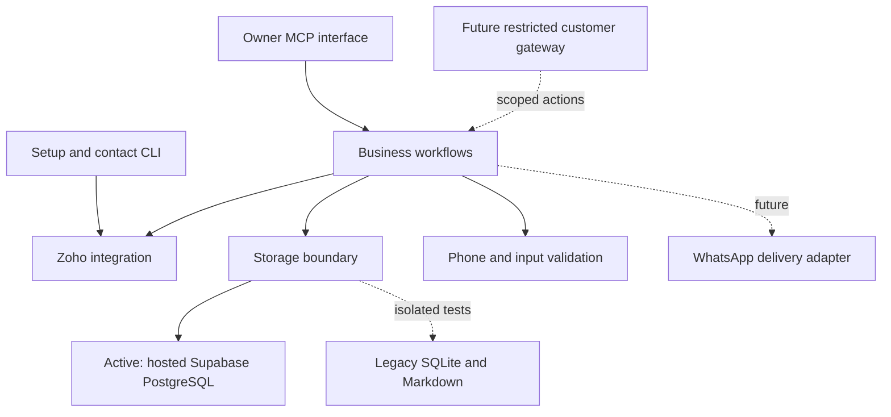

# Repository structure and dependency boundaries

The repository is organized for the existing Zoho workflows and upcoming
WhatsApp integration. Hosted Supabase storage is active; WhatsApp deployment is
still pending. See the [migration and recovery guide](../../supabase/README.md).

```text
src/hustleai/
  config.py                      Central private-data paths
  domain/
    phones.py                    Number normalization
    validation.py                IDs and decimal validation
  integrations/
    zoho/
      auth.py                    Verified HTTPS context
      client.py                  OAuth refresh, GET/POST/PUT, PDFs and pagination
    whatsapp/                    Documented future gateway boundary
  workflows/
    service.py                   Facade, proposals and confirmed dispatch
    clients.py                   Client resolution and creation preparation
    invoices.py                  Invoice reads and validated creation payloads
    payments.py                  Payment preparation and allocation validation
    invoice_review.py            Reorder history, revisions and version approval
    forecast.py                  Weekly reorder forecast and customer cycles
  mcp/
    owner_server.py              17 owner-side Hermes tools
  storage/
    files.py                     Atomic private local writes
    backend.py                   Explicit backend selection; no outage fallback
    repository.py                Organization-scoped journal operations
    postgres/
      repository.py              PostgreSQL transactions, mappings and locks
      migrate.py                 Verified migration and restricted role setup
    legacy/
      repository.py              Legacy backend for isolated tests
      sqlite.py                  Legacy journal bootstrap
      phone_mapping.py           Contact scan, lookup and Markdown export
  cli/
    setup.py                     Initial OAuth setup
    upgrade.py                   Expanded OAuth grant
    contacts.py                  Configure/sync/lookup command
    forecast.py                  Weekly forecast and cycle command
supabase/
  migrations/                    Applied initial PostgreSQL schema
  README.md                      Migration and cutover checklist
scripts/                         Diagram generation
 tests/                          Unit tests, MCP integration tests, fixture policy
 docs/                           Architecture, guides, PRDs and rendered diagrams
 deploy/                         Hermes configuration example and VPS instructions
```



## Rules for new code

- Provider HTTP details belong in integrations. Do not put business approval rules
  into the HTTP transport or copy Meta webhook logic into Zoho methods.
- Workflows decide what may happen and when. MCP functions translate typed tool
  calls into workflow operations; they do not own persistence or provider calls.
- Pure phone/ID/value validation belongs in domain and should not load credentials.
- Customer routes must use a restricted interface; owner MCP access is not shared
  just because both message the same business number.
- SQL belongs in storage repositories. Workflows use domain methods such as
  claim_operation and approve_review. PostgreSQL transactions and advisory locks
  coordinate cooperating processes across machines.
- Message IDs, duplicate suppression, approval binding and uncertain outcomes
  must survive backend migration. No automatic local fallback on database failure.

## Private data

The default for this existing checkout is still the repository root. This keeps
credentials, mapping, journal, PDFs and stored PDF references unchanged. None
of those files was moved during the restructure.

On the VPS, set `HUSTLEAI_DATA_DIR` to a private absolute directory such as
`/var/lib/hustleai`. All runtime paths derive from that setting. Create and
populate it before starting the application. A packaged install outside this
checkout defaults to `~/.local/share/hustleai`; setting an explicit directory is
recommended. Importing config does not read or print secrets.

The credentials and price-list PDF may remain local; both need separate secure
backups. Phone mapping and operation history now live in hosted PostgreSQL. Local files
still require separate backups. See [Supabase recovery](../../supabase/README.md).

## Compatibility and commands

Root `zoho_*.py` files are small compatibility entry points. Business code no
longer lives there. Existing Terminal commands still work from the checkout:

```sh
python3 zoho_setup.py
python3 zoho_upgrade.py
python3 zoho_clients.py lookup
```

After installing the package, use named commands or module entry points:

```sh
.venv/bin/pip install -e '.[postgres]'
.venv/bin/hustleai-contacts lookup
.venv/bin/hustleai-zoho-upgrade
.venv/bin/python -m hustleai.mcp.owner_server
```

Tests now live in `tests/`. The two old root test files remain compatibility
runners. Canonical test command:

```sh
.venv/bin/python -m unittest discover -s tests -v
```

The PRDs and rendered guide are under one docs directory. Regenerate the visual
guide with `python3 scripts/generate_flow_diagrams.py`.
