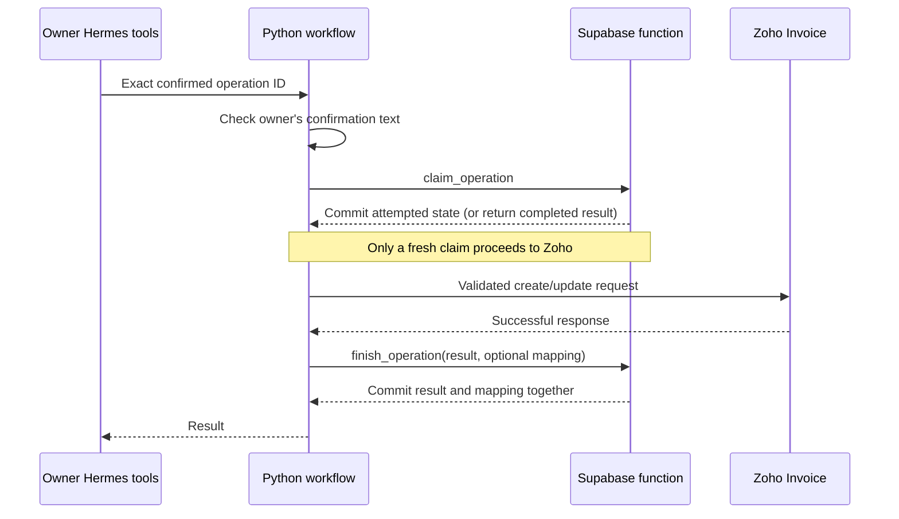

# Database functions and queries

**Status:** applied to Supabase and verified on 2026-09-26.

Python now delegates four atomic changes to PostgreSQL functions in the
`hustle_private` schema. Hermes continues to call the same 14 MCP tools;
it does not receive SQL access. Simple reads remain parameterized queries.

## What each function does

| Function | Inputs | Result and protection |
| --- | --- | --- |
| `claim_operation` | Organization and operation ID | Locks the row, checks the 30-minute expiry using the database clock, then marks it attempted. Completed IDs return their saved result; attempted IDs are rejected. |
| `finish_operation` | Organization, operation ID, result JSON, optional contact ID and phone | Saves the completed result and optional new-client mapping in one transaction. Both writes roll back if either fails. |
| `invalidate_invoice_reviews` | Organization and invoice ID | Invalidates reviews and approvals together before a remote draft edit. |
| `approve_invoice_review` | Organization, review ID, proposed approval ID, expected version, phone and PDF hash | Locks the review, rechecks expiry/status/binding, then saves the approval and review state together. Concurrent retries return the same approval ID. |

These are PostgreSQL **stored functions**, called using `SELECT`, rather than
procedures called with `CALL`. Python owns the surrounding transaction. Function
comments are saved in PostgreSQL as well as in the migration source.

## Where to find them

In Supabase, open **Database → Functions**, and select the `hustle_private`
schema. They are not additional tables in the Table Editor.

- [Function definitions](../../supabase/migrations/202609260002_workflow_functions.sql)
- [Python adapter](../../src/hustleai/storage/postgres/repository.py)
- [Reference read queries](../../supabase/queries/workflow_reads.sql)
- [Upgrade runner](../../src/hustleai/storage/postgres/upgrade.py)

The reference query file defines four optional session-local prepared statements:
phone lookup, operation read, review read and approval read. The application
already executes equivalent parameterized queries. Preparing these statements
manually is not required for normal MCP usage.

## Request flow



The claim commits **before** the remote request. The adapter rejects claims
inside an already-open transaction: rolling back a claim after a Zoho write
would otherwise allow the same request to run again. If Zoho succeeds but saving
its response fails, the operation remains attempted. Inspect Zoho and reconcile;
do not submit another invoice/payment automatically.

Python still handles owner identity at the gateway boundary, confirmation text,
phone normalization, prices/taxes, ownership, live invoice checks, PDF hashing
and external API calls. Invoice advisory locks continue to span those checks.
A database function cannot inspect an external PDF or undo a Zoho API request.

## Permissions

All four functions use `SECURITY INVOKER` and a fixed empty `search_path`, with
fully qualified application tables. They run with the caller's permissions and
preserve organization-specific row-level security. Default public execution is
revoked; execution is granted only to the restricted runtime role (plus the
administrative owner). This follows PostgreSQL's documented
[function security and privilege behavior](https://www.postgresql.org/docs/16/sql-createfunction.html).

The runtime role still has the table privileges needed by invoker functions and
simple queries. Functions centralize transitions; they are not an authentication
boundary against a compromised backend credential. Keep that credential private,
and keep arbitrary SQL out of agent/customer tools.

## Applying upgrades

From the source checkout with private admin credentials available:

```sh
.venv/bin/python -m hustleai.storage.postgres.upgrade
```

The runner verifies previously applied checksums, serializes concurrent upgrades,
and commits new functions, grants and ledger entries together. Rerunning an
unchanged upgrade is a no-op. It does not reimport local data, create local database
copies or make Zoho calls. Never modify an applied SQL migration; add a new one.
Deploy database upgrades before starting application code that requires them.

## WhatsApp boundary

No WhatsApp sending function or webhook worker is enabled by this change.
Webhook claims and delivery deduplication will be implemented with the gateway,
when provider event types, retry rules and delivery reconciliation are concrete.
The current approval function records owner review; it does not send an invoice
or mark one sent, and is not a replacement for a future atomic delivery claim.

## Verified results

30 local/package tests and 30 PostgreSQL integration tests passed. PostgreSQL
tests use disposable schemas and fake Zoho responses. Coverage includes competing
claims and approvals, expired/stale bindings, transaction rollback, restricted-role
RLS against actual foreign-organization rows, public execution denial and migration
checksum/idempotency checks.

After the production upgrade, all eight workflow tables matched their pre-upgrade
content hashes. The runtime login successfully replayed an existing completed
operation without another Zoho request, and all 67 phone mappings remained
accessible. The upgrade created no local database or mapping copies.
