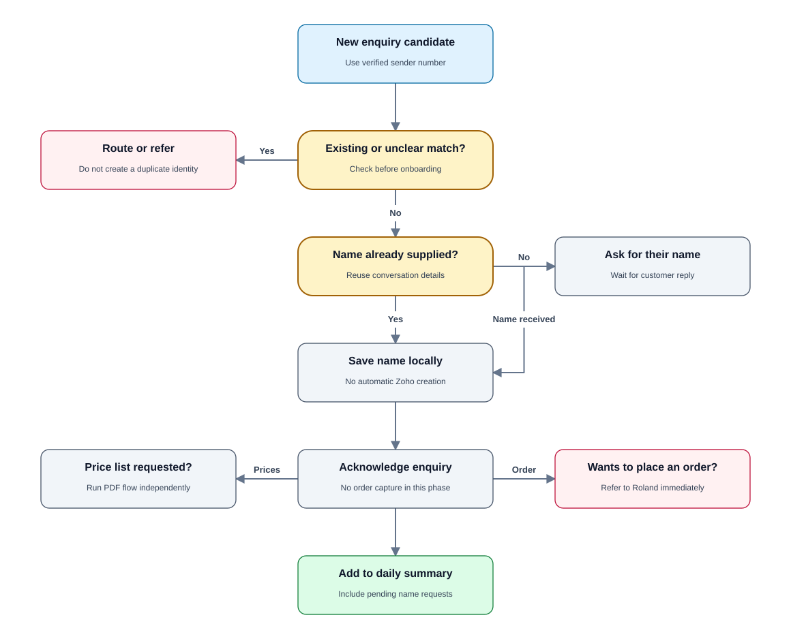
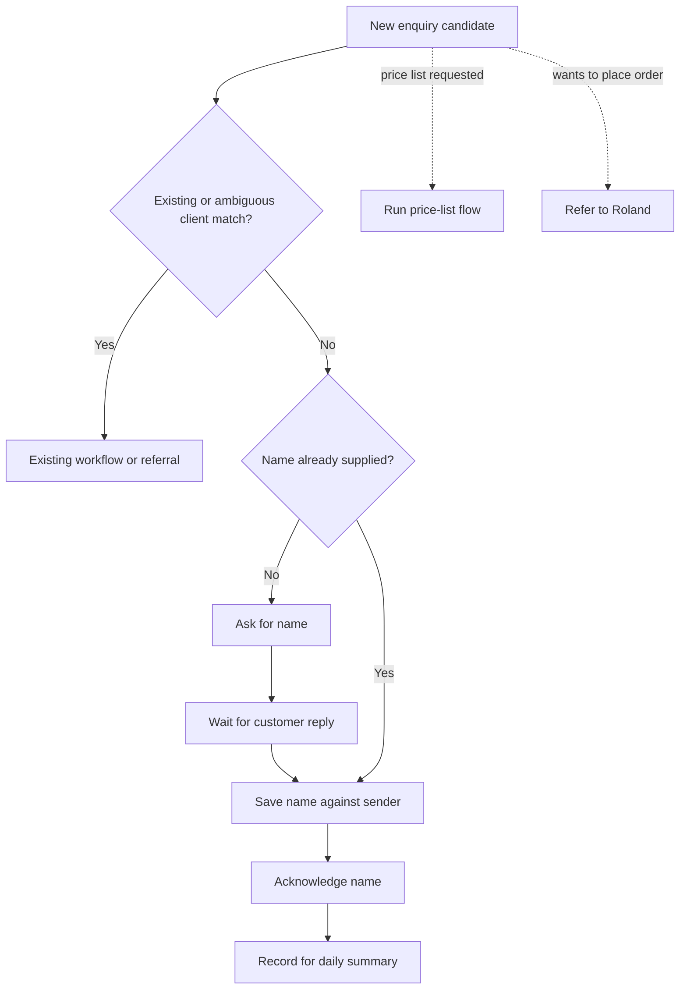

# PRD 02 — New customer enquiries and name collection

[Open the visual flow guide](../flow-guide.html#02-new-customer) · [Open full-size SVG](../diagrams/02-new-customer.svg)

Status: specified; not implemented. See [shared decisions](README.md).

## Goal

Welcome a new enquirer and collect their name. Do not attempt autonomous order
capture in this release. Public price-list requests use [PRD 03](03-price-list.md).

## Trigger and requirements

Trigger: a customer begins a new enquiry and does not resolve to an existing
client, or explicitly identifies themselves as new without conflicting records.

- Treat no Zoho match as a candidate new enquiry, not proof of a new identity.
- Ask for the person's name when missing. Do not require an email or address.
- Store the supplied name against the verified WhatsApp sender in a local enquiry
  record; this storage is a proposed implementation default.
- Confirm receipt politely and avoid repeatedly asking for the same name.
- If a price list was requested, send it independently of name completion; do
  not withhold the approved public PDF while waiting for a name.
- Do not automatically create a Zoho client from name collection. Such creation
  is outside the agreed scope and can be initiated by Roland separately.
- If the person asks to order, refer to Roland for now. Preserve their message
  so future order-taking can be added without changing the identity model.
- Include the enquiry and name-collection status in the daily summary.

## State and exceptions

States: name needed, awaiting name, name captured, referred. Persist sender,
supplied name, timestamps and source message ID. Do not treat a name as verified
legal identity or as authorization to access a similarly named Zoho client.

No reply leaves the enquiry pending; automatic follow-up campaigns are excluded.
A refusal to provide a name does not prevent price-list delivery.

## Acceptance criteria

- A new contact is asked only for their name at this stage.
- A supplied name is reused on subsequent messages from that sender.
- Price-list delivery can complete while the name remains missing.
- Name collection creates no Zoho client, invoice or payment.
- New-customer order requests are immediately referred, not autonomously accepted.
- Pending and completed name collection appear in the daily summary.

## Open questions

Local enquiry retention and deletion rules need approval before production.
The later phase of collecting orders is explicitly deferred.
