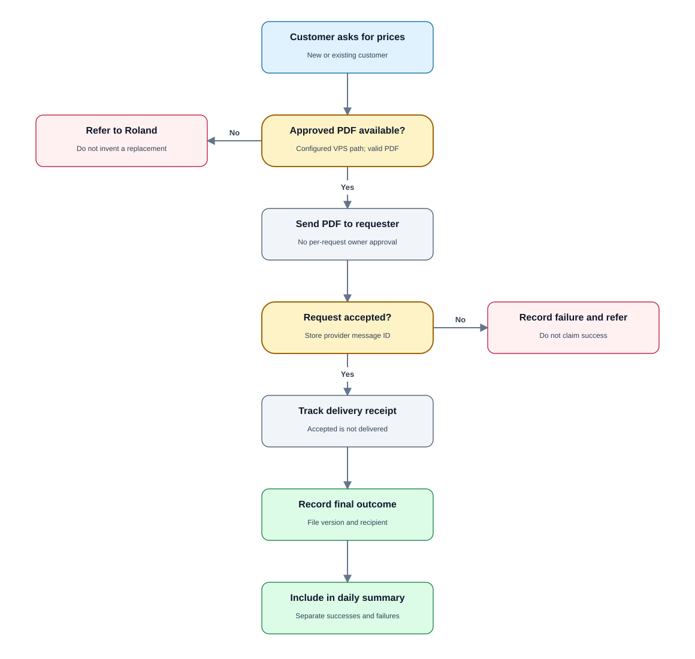
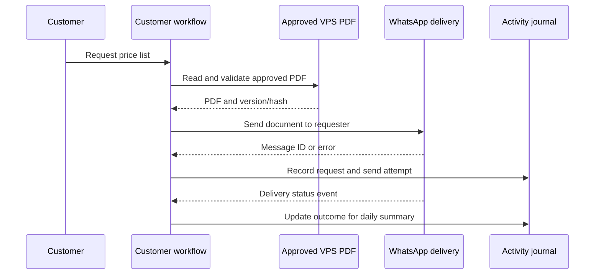

# PRD 03 — Automatic price-list PDF delivery

[Open the visual flow guide](../flow-guide.html#03-price-list) · [Open full-size SVG](../diagrams/03-price-list.svg)

Status: specified; not implemented. See [shared decisions](README.md).

## Goal

Send the approved, existing price-list PDF automatically when a customer asks
for prices. Use the file stored on the VPS; do not generate a catalog from Zoho.

## Trigger and requirements

- Recognize clear price-list requests from new or existing customers.
- Read the configured approved PDF path; customers cannot choose filesystem paths.
- Validate that the file exists, is readable and is a PDF before attempting send.
- Send it as a WhatsApp document to the requesting sender's conversation.
- Record which file version/hash was sent, recipient, provider message ID and
  eventual delivery result. Do not claim delivery merely because a send was queued.
- Price-list delivery does not need Roland's per-request approval.
- Log activity for the 20:00 summary; do not notify Roland separately for every
  successful routine price-list enquiry.
- If the file is unavailable or delivery fails, tell the customer only what is
  known and notify Roland through the immediate referral flow.
- Use an explicitly configured file; never substitute an old invoice or generate
  an unapproved price list as a fallback.

## State and retry behavior

Track requested, queued, API-accepted, delivered or failed. Repeated webhook
processing must not resend. A new explicit customer request may resend the
current approved file. Rate limits and retry thresholds are implementation
configuration; ambiguous outcomes require status reconciliation before retry.

## Acceptance criteria

- A clear request receives the configured PDF without an owner approval prompt.
- Both known and unknown numbers can request it.
- The file is delivered only to that requester's conversation.
- A missing PDF triggers a referral rather than a fabricated attachment.
- Duplicate inbound events do not duplicate document sends.
- Successful sends and failures are represented correctly in the daily summary.

## Dependencies and open questions

Requires PDF path, actual approved document, WhatsApp document upload/send
support and delivery callbacks. Proposed update procedure: Roland replaces the
approved file through an administrative path; in-flight sends retain their
original file hash. Confirm file-size and messaging eligibility constraints
against the deployed provider configuration before launch.
