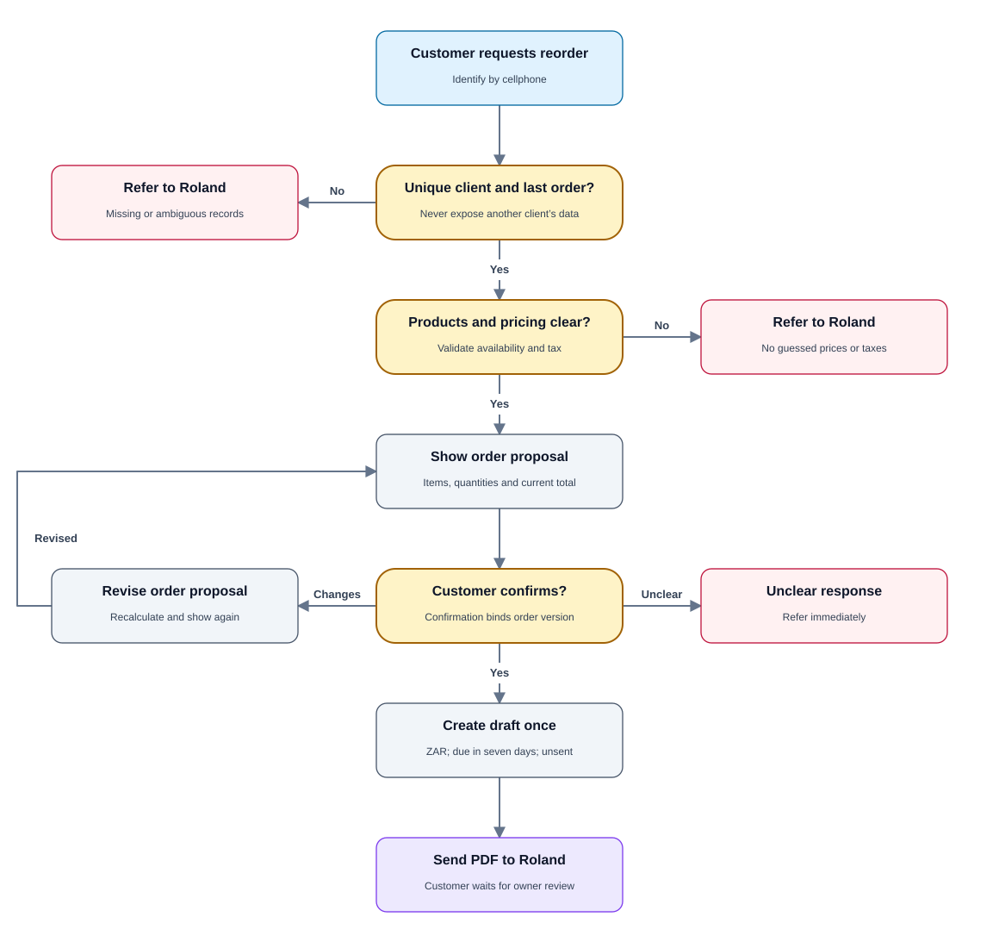
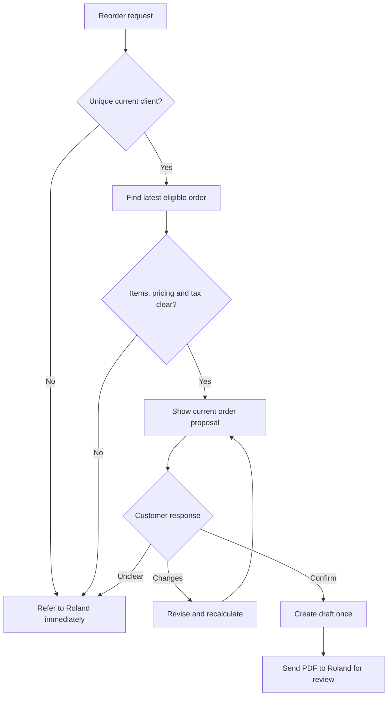

# PRD 04 — Existing customer reorder and draft creation

[Open the visual flow guide](../flow-guide.html#04-reorders) · [Open full-size SVG](../diagrams/04-reorders.svg)

Status: specified; not implemented. See [shared decisions](README.md).

## Goal

Let an existing customer repeat their last order without authorizing customer
invoice delivery. After the customer confirms the proposed order, create a
Zoho draft and send it to Roland for review.

## Trigger and requirements

Trigger: a verified customer requests a reorder.

1. Resolve their phone to exactly one current Zoho client. Refer ambiguous or
   absent matches; never reveal another client's order as a suggestion.
2. Retrieve their last eligible order using invoice history. Proposed selection:
   most recent non-void invoice by date, excluding known test records. Tie and
   eligibility rules require approval before launch.
3. Rebuild the proposed order from items and quantities, checking current product
   availability, prices and tax configuration. Do not blindly copy historic
   discounts, delivery charges or prices.
4. Show item descriptions, quantities, current unit prices, applicable tax,
   delivery charges and total for customer confirmation. If historical charges
   cannot be reproduced safely, refer to Roland.
5. Let the customer request changes before confirmation; show a revised order
   and obtain confirmation of its current version.
6. Only customer confirmation authorizes this specific draft creation. Bind it
   to the verified sender, selected client and immutable order version.
7. Create an unsent ZAR invoice with seven-day terms and the approved tax
   treatment. Never infer that production invoices should have no tax merely
   because the test invoice did.
8. Send the draft PDF to Roland, not the customer. Tell the customer their order
   is awaiting review without claiming an invoice has been sent.

## State, data and exceptions

Store source invoice ID, selected client, sender, order version, line snapshot,
confirmation event, new invoice ID and owner-review status. Retry protection
must prevent two drafts from one confirmation. On uncertain create outcome,
reconcile with Zoho before retrying.

No prior eligible invoice, inactive products, unsupported currency, unresolved
tax, changed pricing, duplicate clients or lookup outages trigger referral.
Do not substitute a product or charge without confirmation. A customer change
after draft creation reopens review; the mechanism is a proposed default and
must invalidate any previous delivery approval if the invoice is changed.

## Acceptance criteria

- The customer sees only their own previous order.
- Current pricing is shown before confirmation; price changes are not hidden.
- No draft is created before customer confirmation of the current proposal.
- Repeated confirmation events create at most one draft.
- The resulting invoice is unsent and has seven-day terms.
- Only Roland receives the draft PDF.
- An unclear or unsafe reorder is referred with no speculative mutation.

## Dependencies and open questions

Requires customer-scoped draft authorization distinct from the existing
owner-only confirm tool. Order-selection rules, delivery/discount handling and
production tax settings must be resolved. Payment recording and collection are
not part of this flow.
