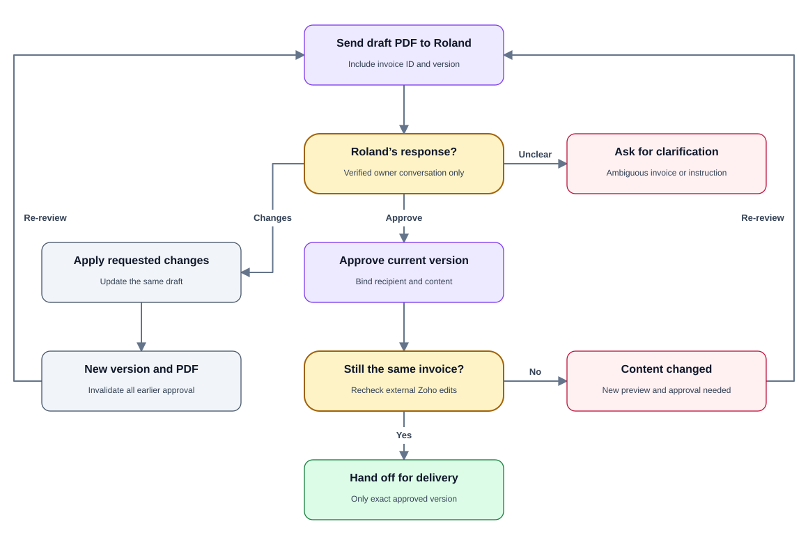
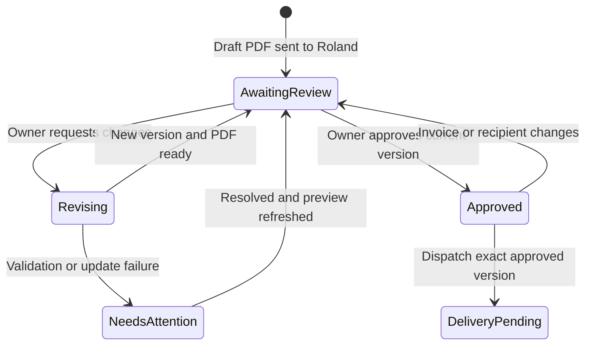

# PRD 05 — Roland's invoice review and revisions

[Open the visual flow guide](../flow-guide.html#05-owner-review) · [Open full-size SVG](../diagrams/05-owner-review.svg)

Status: specified; not implemented. See [shared decisions](README.md).

## Goal

Roland receives a draft invoice privately, can request changes, and approves
only the exact version he wants delivered to the client. Owner preview delivery
must never mark the invoice sent in Zoho.

## Trigger and requirements

Trigger: a reorder draft is created or revised.

- Deliver the PDF to **+27837758811**, with customer name/number, invoice number,
  total, due date and a version identifier.
- Explicitly identify it as an unsent draft awaiting owner review.
- Accept owner instructions only from the verified owner conversation.
- Resolve every revision to an unambiguous invoice and current version. Ask if
  “change it” or “looks good” could refer to more than one pending invoice.
- Apply requested supported changes to the same draft; do not create a second
  invoice for a revision. Recompute totals and validate product/tax settings.
- After each update, increment the review version, obtain a fresh PDF and send
  the new preview to Roland. Invalidate any previous approval.
- Keep the invoice unsent for every owner preview, even when WhatsApp reports
  that Roland received or read it.
- Bind approval to invoice ID, exact content/version and client destination.
  Pass that authorization to [PRD 06](06-approved-delivery.md).
- Detect manual edits in Zoho before delivery. If contents changed since review,
  require a new preview and approval.

## Data, errors and concurrency

Persist invoice ID, content fingerprint/version, PDF hash, recipient, owner
preview message ID, revision requests and approval event. Serialize competing
updates to one invoice. Approval cannot race with a revision to send stale data.

If Zoho updates successfully but PDF generation fails, keep the updated invoice
and report the preview failure; do not claim the old preview is current. A failed
revision leaves the prior approval unusable until the actual state is reconciled.
Do not edit sent/paid invoices through this draft-only flow; refer those cases.

## Acceptance criteria

- A PDF delivered to Roland leaves Zoho's invoice status unsent.
- A valid revision updates the same invoice and produces a fresh preview.
- A customer's “approved” message cannot authorize delivery to themselves.
- Approval of version 1 cannot send version 2, and version 1 cannot be sent after
  a revision made it stale.
- External Zoho edits are detected before dispatch and require renewed review.
- Ambiguous owner replies cause clarification without a send.

## Dependencies and open questions

Requires invoice update permissions, an update method, versioned approvals,
PDF regeneration and owner notification delivery. Supported revision fields
should initially cover line items, quantities and prices; other field changes
should be referred until explicitly supported. Cancellation/rejection handling
is an open UX detail; it must never imply delivery approval.
