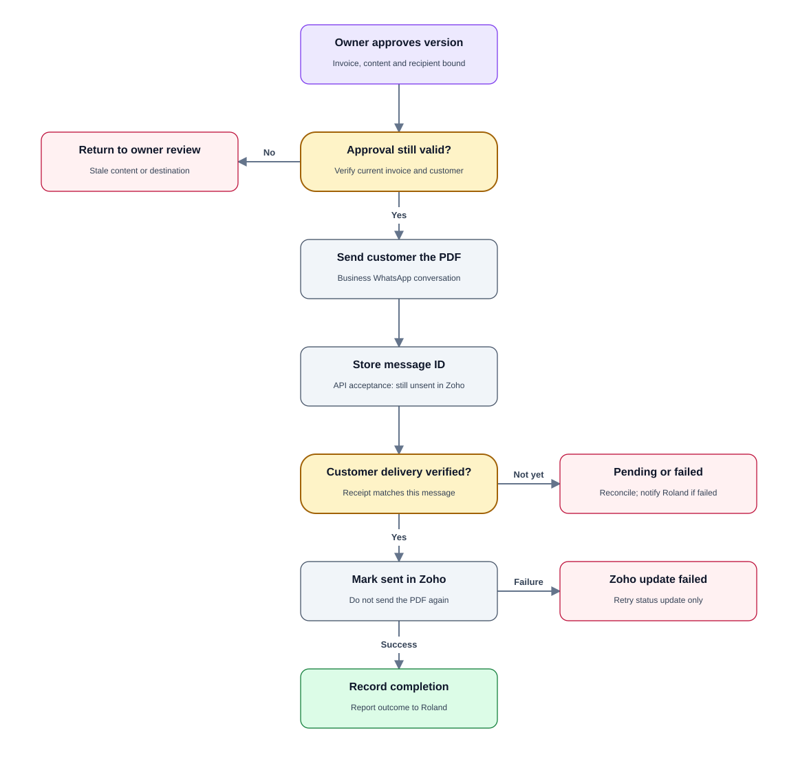
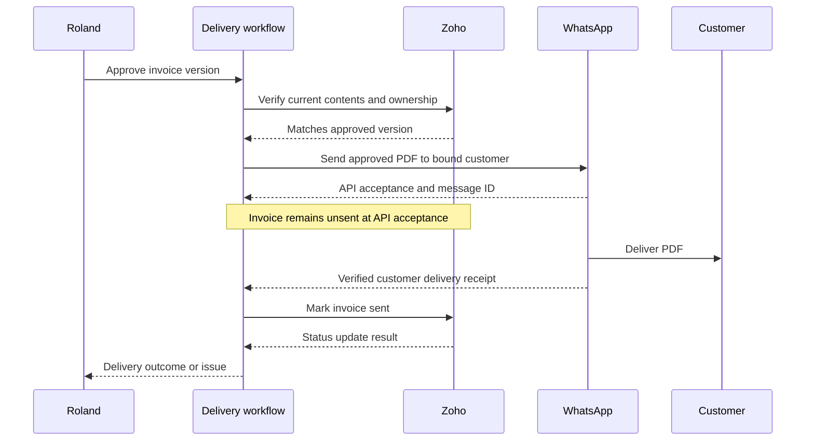

# PRD 06 — Approved invoice delivery and Zoho sent status

[Open the visual flow guide](../flow-guide.html#06-approved-delivery) · [Open full-size SVG](../diagrams/06-approved-delivery.svg)

Status: specified; not implemented. See [shared decisions](README.md).

## Goal

After Roland approves the latest invoice, deliver its PDF to the correct
customer through the business WhatsApp number. Only successful customer
delivery may trigger marking that invoice sent in Zoho.

## Trigger and requirements

- Require a valid owner approval tied to invoice ID, current version and recipient.
- Recheck current Zoho content and client association before dispatch.
- Send the approved PDF through the customer's business WhatsApp conversation.
  Never infer a different destination from arbitrary message content.
- Distinguish API acceptance from successful delivery. Proposed operational
  definition: a verified provider `delivered` receipt (or stronger `read` receipt)
  for the stored customer message ID, subject to verification with Meta's API.
- Owner preview receipts do not count as customer delivery.
- Persist the provider message ID and processing state before reconciling events.
- Mark the invoice sent in Zoho only after verified customer delivery.
- If delivery succeeds but Zoho status update fails, retry/reconcile the status
  update without sending the PDF again.
- A failed or unknown delivery must not mark the invoice sent. Notify Roland of
  terminal failures; keep uncertain outcomes pending reconciliation.
- Never automatically resend under a new approval ID after an uncertain outcome.

## State and failure handling

States: approved, dispatching, accepted, delivered/status-pending, completed,
failed or uncertain. Store invoice/version, recipient, PDF hash, approval event,
attempt ID, provider message ID and status-update result. Deduplicate and handle
out-of-order delivery events without moving backwards from delivered to pending.

At dispatch, enforce applicable WhatsApp session/template eligibility. If a
permitted document delivery cannot be made, report the blocker; never fall back
to emailing the client. Template setup is an implementation dependency.

## Acceptance criteria

- No approval means no customer delivery.
- A stale version or changed recipient prevents dispatch.
- API acceptance alone leaves the invoice unsent.
- A receipt for Roland's preview never changes the invoice to sent.
- Verified customer delivery triggers exactly one logical sent-status update.
- Replayed webhooks do not resend the document or duplicate updates.
- A Zoho status failure after delivery retries only the update, not the message.
- Every terminal delivery failure is visible to Roland.

## Dependencies and open questions

Requires WhatsApp send and receipt handling, Zoho mark-sent capability and the
necessary OAuth permission. Verify how Zoho represents this transition for
partially paid or otherwise changed invoices; do not overwrite incompatible
states. Delivery timeout, retries and final failure thresholds need configuration.
