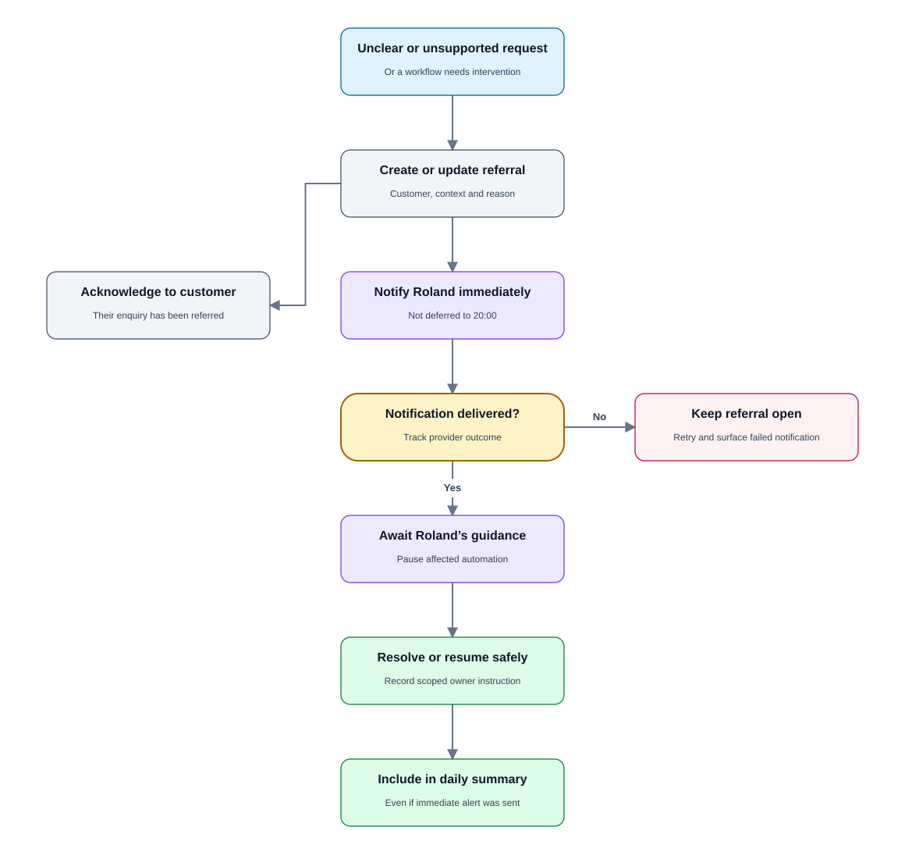
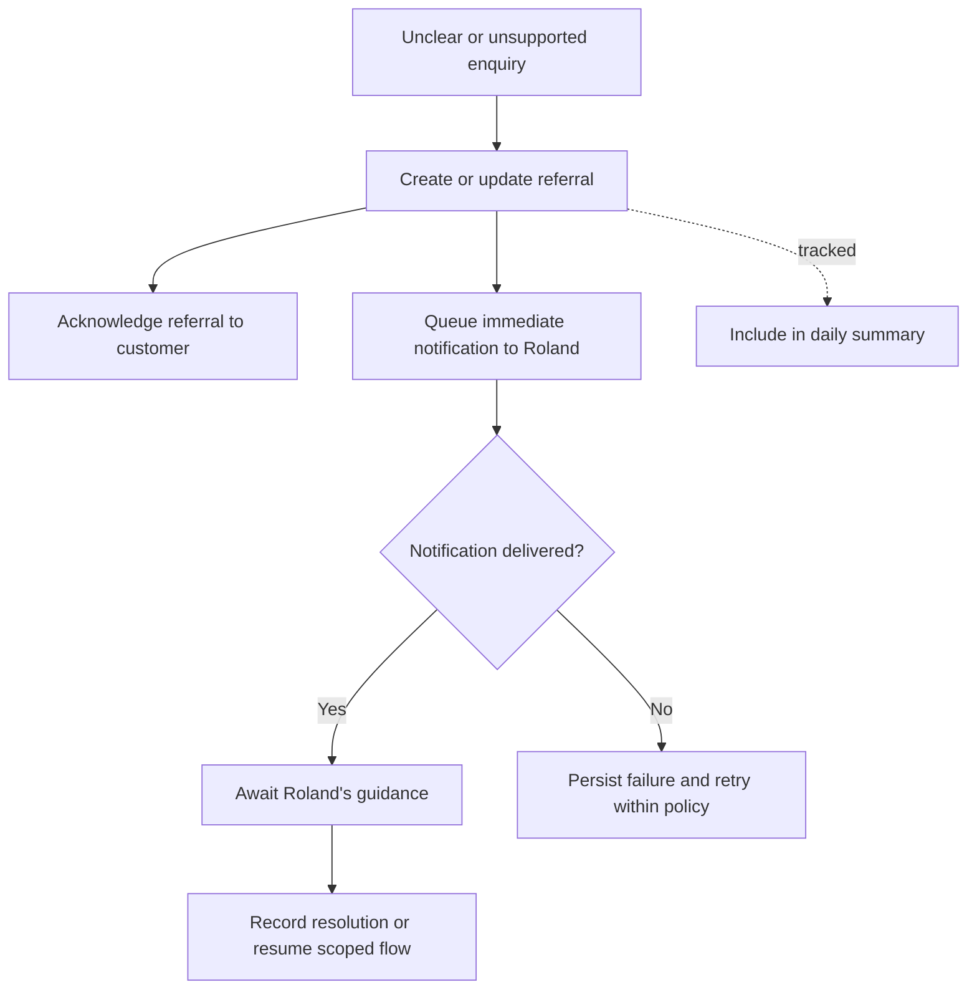

# PRD 07 — Immediate referrals for unclear or unsupported enquiries

[Open the visual flow guide](../flow-guide.html#07-referrals) · [Open full-size SVG](../diagrams/07-referrals.svg)

Status: specified; not implemented. See [shared decisions](README.md).

## Goal

Bring Roland into any conversation that cannot safely continue through a new
customer, price-list or existing customer reorder workflow. Do not defer these
notifications to the daily report.

## Trigger and requirements

Triggers include unclear intent, unsupported requests, uncertain identity,
ambiguous clients, missing prior orders, unavailable products, unresolved tax,
new-customer order requests and failures requiring owner intervention.

- Immediately queue a WhatsApp notification to **+27837758811**.
- Include the customer's supplied name if known, verified number, relevant
  message/context, reason for referral and any affected order/invoice reference.
- Explain to the customer that their enquiry has been referred. Do not claim
  Roland has read it or promise a response time.
- Pause the affected automated action while it requires clarification.
- Group repeat messages into the existing open referral where appropriate;
  deduplicate provider redelivery of the same event.
- Record referral, notification and resolution status for the daily summary.
- Treat a routine known price-list request as routine; do not notify immediately
  unless something prevents completing it.

## State and operational boundaries

Store referral ID, sender, relevant message IDs, reason, workflow reference,
opened/updated/resolved timestamps and owner-notification outcome. “Immediate”
means the application attempts delivery as soon as classification completes,
not a guarantee against provider or network outages.

If the owner notification fails, preserve the referral and surface it in the
next available owner interaction and summary. An alternative notification channel
has not been chosen. Resuming after handoff must not treat customer text as
Roland's instructions. Cross-conversation owner reply commands need a defined
customer/referral target before implementation.

## Acceptance criteria

- An unclear enquiry queues a notification without waiting until 20:00.
- Notification identifies the customer and explains why intervention is needed.
- A repeated webhook does not generate another referral alert.
- The customer receives no fabricated answer or completion claim.
- Failed notifications remain visible as unresolved operational work.
- Referrals are included in the summary even if an immediate alert was sent.

## Open questions

Confirm how Roland replies to a referred customer: a scoped relay command or a
manual reply outside the agent. Until designed, notification must not implicitly
authorize automated customer replies. Define grouping thresholds and retention
before launch.
