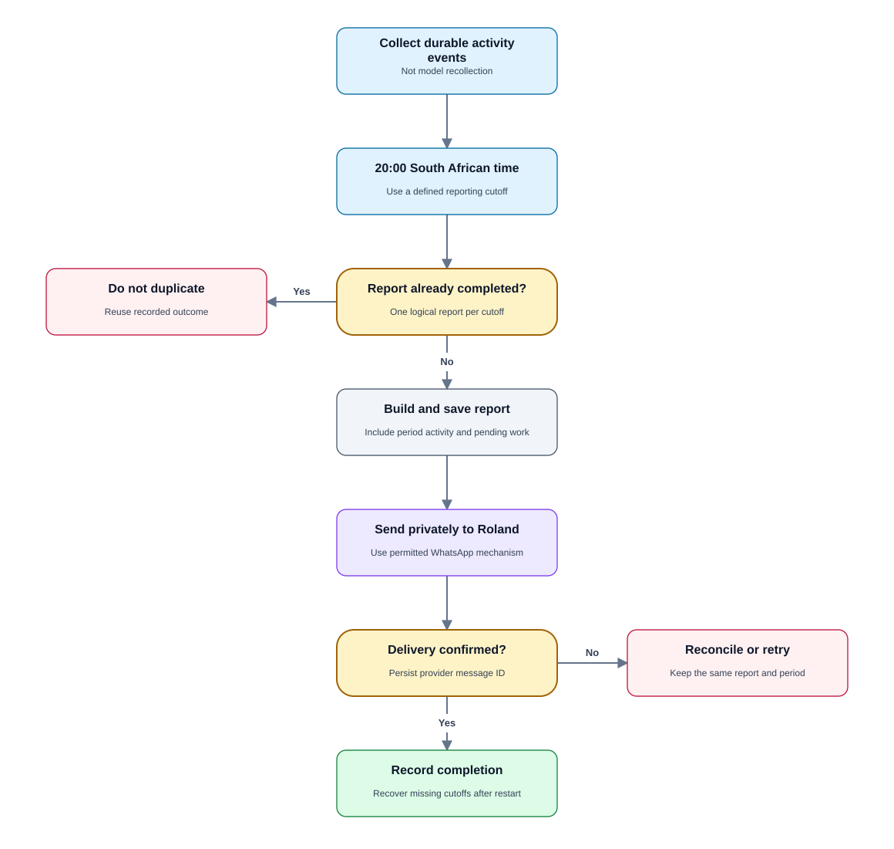
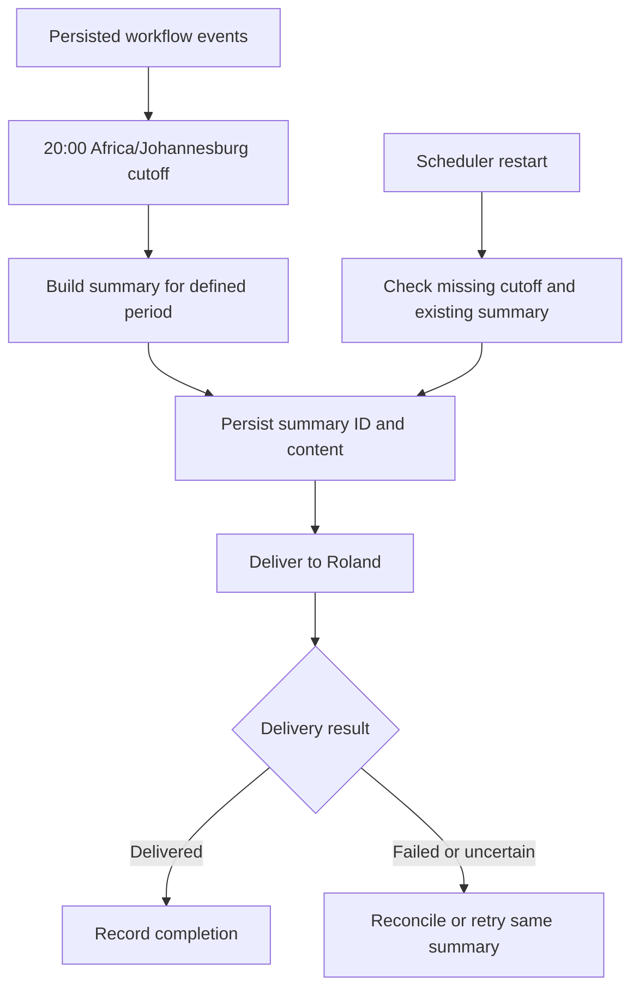

# PRD 08 — Daily WhatsApp summary at 20:00 South African time

[Open the visual flow guide](../flow-guide.html#08-daily-summary) · [Open full-size SVG](../diagrams/08-daily-summary.svg)

Status: specified; not implemented. See [shared decisions](README.md).

## Goal

Give Roland one daily overview of customer activity, pending invoice reviews and
issues, without interrupting him for routine price-list deliveries.

## Schedule and recipient

- Schedule at **20:00 in `Africa/Johannesburg`**, regardless of the VPS timezone.
- Deliver privately to **+27837758811** through the business WhatsApp integration.
- Unclear enquiries still use immediate referrals; the report is not a substitute.
- Proposed report period: previous local 20:00 cutoff up to the current cutoff
  (start inclusive, end exclusive). First report covers activity since activation.
- Label the report period and distinguish period activity from older unresolved
  work. Events after cutoff belong to the next report.

## Report contents

| Section | Required information |
| --- | --- |
| New enquiries | Names collected, numbers, and enquiries awaiting a name. |
| Price lists | Number of distinct requests, send outcomes and failures. |
| Reorders | Confirmed orders, drafts created and customer confirmations pending. |
| Owner review | Invoice numbers and totals waiting for Roland or revision. |
| Customer delivery | Approved invoices delivered, pending delivery, or failed. |
| Referrals | New and unresolved cases, including immediate-notification failures. |
| Integration issues | Uncertain Zoho writes, status reconciliation or gateway outages. |

Use verified workflow events; do not generate counts from an unstructured model
recollection of conversations. Do not call a draft sent, an accepted message
delivered, or a recorded test payment money received.

## State and recovery

Use one logical summary ID per owner and cutoff. Persist period boundaries,
content snapshot, send attempt, provider message ID and delivery state.
Restarts must not generate duplicate reports. A delayed report must label its
original period and not silently count activity twice. Proposed recovery policy:
send one missed report on recovery and avoid a burst of duplicate notifications;
multiple-day outage behavior remains to be finalized.

Scheduled notifications may require an approved WhatsApp messaging mechanism
outside an active conversation. Validate and configure that before production.
If sending is blocked, retain the summary for retry and owner retrieval.

## Acceptance criteria

- A VPS running in UTC still schedules for 20:00 South African local time.
- A cutoff-boundary event belongs to exactly one report period.
- The same scheduler job running twice produces one logical summary.
- Delivered price lists and failures are counted separately.
- Pending review and unresolved referrals remain visible across days without
  inflating the current period's new-activity count.
- Only Roland receives the report.
- A send failure preserves the report and its delivery state.

## Open questions

Proposed no-activity behavior is a short “No new activity” report with any pending
work still listed. Confirm this behavior, maximum report length/splitting,
retry schedule and multi-day outage recovery policy before launch.
