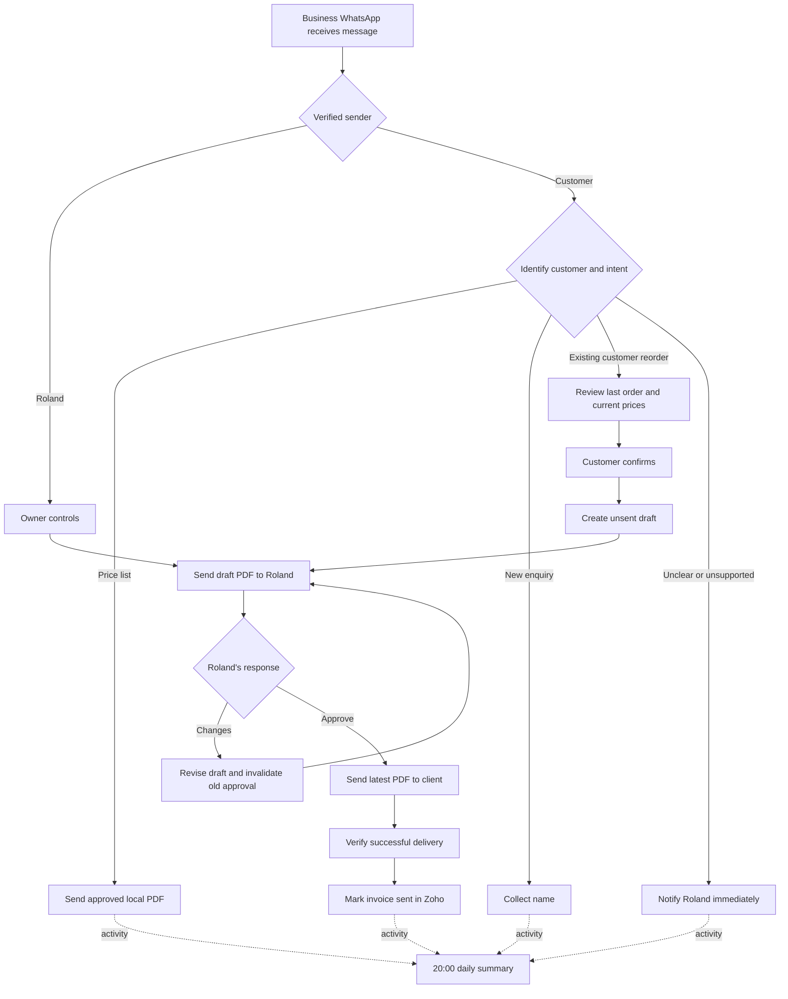

# WhatsApp business workflow PRDs

Status: agreed product direction; workflow implementation and live deployment pending.
Owner: Roland Achary. Specification date: 2026-09-26.

These product requirements documents describe the intended behavior. They do not
claim that the current repository already implements these workflows. Existing
Zoho tools and the code walkthrough remain documented under [docs](../architecture/CODE_WALKTHROUGH.md).

## Visual flow guide

Open [flow-guide.html](../flow-guide.html) in a browser to view all eight diagrams
with navigation and zoom controls. It works offline without Mermaid support.
Each PRD also embeds its standalone SVG diagram from [diagrams/](../diagrams).
To regenerate the visuals after editing their source definitions, run
`python3 scripts/generate_flow_diagrams.py`.

## Flows

| PRD | User outcome |
| --- | --- |
| [01 — Message routing and access](01-message-routing.md) | Customer messages and Roland's private commands reach the correct workflow. |
| [02 — New customer enquiries](02-new-customer.md) | A new enquirer can provide their name without being pushed to order. |
| [03 — Price-list delivery](03-price-list.md) | A requester receives the approved PDF stored on the VPS. |
| [04 — Existing customer reorder](04-reorders.md) | A customer confirms their previous order with current pricing and receives no invoice yet. |
| [05 — Owner review and revisions](05-owner-review.md) | Roland reviews and changes a draft while it stays unsent in Zoho. |
| [06 — Approved customer delivery](06-approved-delivery.md) | The latest approved PDF reaches the correct client before Zoho is marked sent. |
| [07 — Immediate referrals](07-referrals.md) | Unclear or unsupported enquiries reach Roland immediately. |
| [08 — Daily summary](08-daily-summary.md) | Roland receives a consolidated report at 20:00 South African time. |

## End-to-end experience

## Confirmed product decisions

- Hermes runs on a DigitalOcean VPS using Meta's WhatsApp Business integration.
- The business number is separate and not yet supplied.
- Roland's authorized owner number is **+27837758811**.
- The approved price list is an existing PDF on the VPS; its path is pending.
- New-customer scope is name collection, with order-taking reserved for later.
- Existing customers confirm a reorder before the system creates a draft invoice.
- Customer reorder confirmation authorizes that specific draft creation. This is
  a scoped exception to the current tools' owner-only write confirmation rule,
  not a grant of general Zoho access to customers.
- Invoices use ZAR, intended VAT-inclusive prices, and seven-day payment terms.
- Sending a PDF to Roland must not mark an invoice sent.
- Roland's approval authorizes customer WhatsApp delivery of the latest version.
- Unclear enquiries notify Roland immediately. Summaries arrive at 20:00 in
  `Africa/Johannesburg`.
- Bank-statement processing, automatic payment matching and customer acquisition
  order-taking are outside this release.

## Cross-flow requirements

1. Verify inbound webhook authenticity before trusting sender identity. Match
   the owner using the normalized sender number, never message text or a name.
2. Keep owner and customer contexts, tool permissions, and invoice access separate.
3. Persist event IDs, workflow IDs, versions and delivery attempts so restarts or
   repeated webhooks do not duplicate invoices, notifications or sends.
4. Treat client names, messages, product descriptions and PDFs as data, not
   instructions granting access or overriding confirmation rules.
5. Store the Zoho contact-ID/phone mapping and workflow state in hosted Supabase,
   following the later database decision. Do not maintain a local Markdown copy. Upcoming
   delivery/webhook state must use the hosted journal with atomic deduplication.
6. Record enough audit context to explain who requested, confirmed, changed,
   approved and delivered each invoice. Never include credentials in logs.
7. Verify channel eligibility and approved messaging mechanisms for outbound
   notifications. Do not assume scheduled or proactive WhatsApp messages can
   always be sent as ordinary replies. Validate current Meta requirements at
   implementation time; template setup may be a release dependency.
8. Distinguish draft creation, owner preview, customer API acceptance, customer
   delivery receipt and Zoho sent status. Never collapse them into one event.
9. Live calls must not silently invent taxes, substitute unavailable products,
   change prices after confirmation, or select among ambiguous clients.

## Implementation status

Existing code supports basic Zoho operations plus owner-side reorder retrieval,
confirmed draft revisions, versioned PDF previews and version-specific approval.
See [the implementation guide](../guides/ZOHO_WORKFLOW_TOOLS.md) for methods and limits.
These extensions passed local tests and an authorized live draft-update and
version-approval test with invoice UPDATE permission. They do not implement the complete customer workflows in these PRDs.

Customer gateway routing, name collection, customer-scoped draft authorization,
WhatsApp delivery and receipt tracking, sent-state updates, immediate referrals
and scheduled summaries remain pending. The current MCP is owner-side only.

## Open decisions and launch dependencies

| Item | Current position |
| --- | --- |
| Business number, VPS access, domain/webhook setup | Pending provisioning. |
| Approved PDF path and update procedure | Pending artifact and configuration. |
| Production tax treatment | Needs confirmation: Zoho currently has no configured taxes. Prior no-tax approval applied only to the live integration test. |
| Meaning of last order | Proposed: latest non-void invoice, excluding known tests; approve selection rules before launch. |
| Unknown numbers vs genuinely new customers | A lookup miss alone is insufficient; clarify and refer unresolved cases. |
| New Zoho client creation | Not authorized automatically by name collection; proposed local enquiry record only. |
| Changes requested by customers after confirmation | Proposed: reopen order review; no silent amendment or delivery. |
| Handoff and delivery timeouts | Proposed retry thresholds need operational configuration. |
| Daily report window | Proposed previous 20:00 cutoff to current cutoff; first run since activation. |
| Empty summary | Proposed short no-activity report; confirm before launch. |
| Retention and fallback notification channel | Pending owner decisions. |

Each PRD separates confirmed requirements from proposed defaults and remaining
questions. Acceptance criteria are requirements for implementation, not reports
of completed tests.
