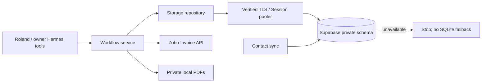

# Supabase storage

**Active:** the local application now uses hosted PostgreSQL through Supabase's
Session pooler, with `verify-full` TLS and the downloaded CA certificate. The
VPS and WhatsApp gateway are still future deployment work.

The verified cutover on 2026-09-26 imported **67 phone mappings, 5 operations,
2 invoice reviews and 2 approvals**. Record contents and mapping pairs were
compared after import, not just counted. All imported reviews and approvals are
invalid history; a new owner review is required before any future delivery.
No Zoho clients, invoices or payments were created or changed during migration.

## What stores what

| Location | Responsibility |
| --- | --- |
| Zoho Invoice | Authoritative clients, products, invoices and recorded payments |
| Supabase `hustle_private` schema | Phone index, operation claims/results, versioned reviews and approvals |
| Local private data directory | OAuth credentials, restricted database settings, CA certificate and PDF files |
| Legacy Markdown mapping | Removed locally after hosted verification; hosted sync does not recreate it |
| Legacy SQLite journal | Removed locally after hosted verification; history is in Supabase |

A new client confirmed through the app adds its mapping directly to Supabase.
It does not create a local Markdown copy. Run `hustleai-contacts sync` after
contacts change outside the app; a complete scan replaces the hosted index and
keeps the data in Supabase only. Shared numbers preserve every matching contact ID.



## Code entry points

- `src/hustleai/storage/backend.py`: selects the configured repository and blocks
  calls during storage maintenance. Unknown backends are rejected.
- `storage/repository.py`: operation claims, results, reviews and approvals.
  Workflows call methods rather than embedding SQL.
- `storage/postgres/repository.py`: verified connections, PostgreSQL transactions,
  phone index queries and session advisory locks.
- `storage/postgres/migrate.py`: private snapshot, versioned schema application,
  restricted-role provisioning, atomic import, reconciliation and cutover.
- `storage/legacy/`: retained SQLite/Markdown support for isolated tests and
  inspecting old data. It is never selected automatically when Supabase fails.

Every service call owns and closes its database session. A database connection
must succeed before the service initializes the Zoho API. Operation claims use
row locks and commit `attempted` before the remote request. Invoice locks span
review/update/approval actions across cooperating app processes. A mapping sync
and app-side client creation share an organization lock.

These protections do not lock Zoho's UI or other applications. Live ownership,
invoice content and PDF hashes are still checked. Separate proposals are not
business-level duplicates automatically; never replace an uncertain operation
without reconciling Zoho first.

## Private configuration

`.zoho-local.json` now includes `"storage_backend": "postgres"`, preserving the
organization, country code and excluded test invoice IDs.

- `.supabase-runtime.json` holds the app's restricted login. It has access only to
  the four active workflow tables, with an organization-specific RLS policy.
  It cannot create tables in the private schema or access another organization's
  records. Future WhatsApp tables have no runtime grants yet.
- `.supabase-credentials.json` holds administrative setup credentials. Runtime
  workflows do not load it. Keep it on the maintenance machine rather than
  copying it into the Hermes runtime on the VPS.
- `prod-ca-2021.crt` is the public CA certificate downloaded from Supabase. Its
  absolute path is saved as `sslrootcert` in each connection settings file.
  Update that path privately when moving to the VPS. Do not disable TLS checks.

Both credential files have mode `0600`. Never paste their contents into chat or
put them in Git. Hermes gets workflow tools, not credentials or a general SQL tool.
Use **Session pooler, port 5432**; transaction pooling is unsuitable for these
session advisory locks.

## Migration and verification

The initial schema SQL is tracked by checksum in `schema_migrations`. The source
record hash is stored in `legacy_imports`. These tables are administrative only.
Do not edit an applied migration; add another migration for future schema changes.

The migration command is retained for a fresh installation or interrupted
pre-cutover migration. **Do not reimport old SQLite data into a running hosted
installation.** The command detects an already selected hosted backend.

```sh
.venv/bin/python -m hustleai.storage.postgres.migrate
```

Before a fresh cutover, stop Hermes/MCP processes and all local workflow commands.
The command adds a maintenance marker and takes an exclusive SQLite lock, but it
cannot cancel an already-running remote API request. A failure retains the marker
so calls stay blocked until the migration is reconciled. Resume with the same
source; mismatched source hashes or untracked target data are rejected.

The remaining private backup files are under `backups/supabase-cutover-*/`.
At Roland's request, the migrated SQLite journal and Markdown mapping were
removed from both the runtime directory and migration backups after their
contents were verified against Supabase. Backup manifests were updated.
Credentials, configuration, certificates and PDFs remain because their contents
were not migrated. There is no longer a local pre-cutover database snapshot.
The `hosted-runtime/` subdirectory preserves the restricted login and hosted
configuration. These files contain secrets and are excluded from Git.

## Tests

Default tests use temporary local state and never connect to Supabase:

```sh
.venv/bin/python -m unittest discover -s tests -v
```

The opt-in database suite creates and removes a unique disposable schema in the
configured project using saved administrative settings. Zoho is faked throughout:

```sh
HUSTLEAI_TEST_POSTGRES=1 .venv/bin/python -m unittest tests.integration.test_postgres -v
```

30 PostgreSQL tests passed after the function upgrade, alongside 30 local/package tests. Database coverage includes competing operation claims, cross-session
invoice locks, uncertain writes, result/mapping transaction rollback, organization
scoping, expiry, PDF tampering and approval invalidation. Cutover also verified
restricted-role reads and rejection of cross-organization inserts and schema DDL.

## Recovery and VPS deployment

A VPS failure does not delete hosted Supabase data. Rebuild the application,
restore the private runtime files, update the CA path, set `HUSTLEAI_DATA_DIR`,
and reconnect to the same database. Preserve operation IDs and attempted states.
Never switch to the stale local SQLite journal to continue operating.

Supabase holds PDF references and hashes, **not PDF bytes**. Restore the approved
price list and other required files separately. A lost review PDF requires a new
owner preview and approval; an old database approval must not authorize a different
PDF. Migrated reviews are already invalid and keep their historical local paths.

**Backup automation and an off-device restore drill are not configured yet.** The
remaining local file backups cannot survive loss of this computer and do not
contain a database backup.
Arrange encrypted off-device backups of credentials, required PDFs and periodic
hosted database exports, with a tested restore procedure. Verify backup retention
and restoration options for your actual Supabase plan; do not assume hosted
storage by itself is a complete backup strategy.

After hosted writes begin, restoring the old SQLite snapshot is not a safe
rollback: it would lose newer claims and approvals. Pause operations, restore the
hosted database into an isolated target, reconcile uncertain operations with Zoho,
and revoke restored delivery approvals before enabling service again.

## Stored workflow functions

The [database function guide](../docs/guides/DATABASE_FUNCTIONS.md) documents the
four atomic transitions used by the Python repository, reference read queries,
permissions and the separate additive upgrade command. The initial migration
remains immutable; upgrades do not reimport deleted local data.

Migration `202609260002_workflow_functions.sql` is applied. Its four functions
are visible under Database → Functions → `hustle_private`. All workflow records
were unchanged by the upgrade.
